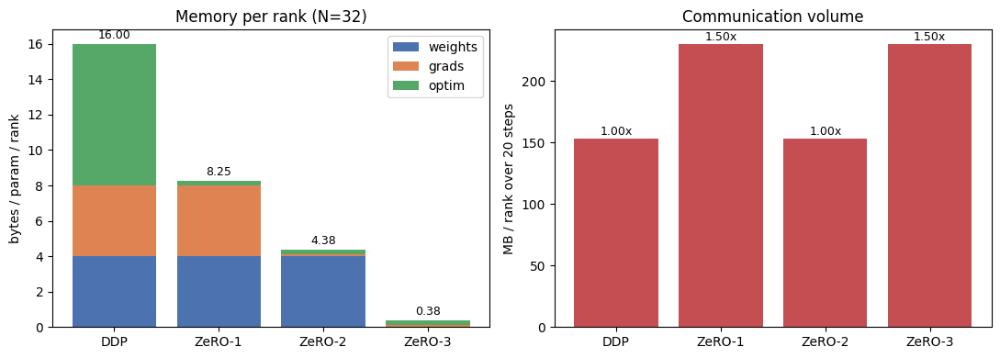

# ERA-V5-Assignment12-DeepSpeedZeRO

# ZeRO-1 / ZeRO-2 / ZeRO-3 on 32 Virtual GPUs

Simulating DeepSpeed's Zero Redundancy Optimizer to see exactly where
training memory goes and what sharding it costs in communication.

## 1. The problem

In standard Distributed Data Parallel, every GPU holds a complete copy of
the weights, the gradients, and the optimizer state.

The waste: after the gradient all-reduce, all 32 ranks hold the same gradients 
and compute the full updates. ZeRO's idea is to reduce memory redundancy across data-parallel process

## 2. Where the memory goes

fp32, Adam. Per parameter:

| Item | Bytes |
|------|-------|
| Weights | 4 |
| Gradients | 4 |
| Adam `m` | 4 |
| Adam `v` | 4 |
| **Total** | **16** |

The optimizer state is half of the total, which is why ZeRO-1 is able to reduce the optimizer-memory footprint by a factor of the number of data-parallel ranks. 

Each ZeRO stage shards one more category:

| Stage | Shards | Per-rank bytes/param |
|-------|--------|----------------------|
| DDP | nothing | 16 |
| ZeRO-1 | optimizer state | 4 + 4 + 8/N |
| ZeRO-2 | + gradients | 4 + 4/N + 8/N |
| ZeRO-3 | + weights | 16/N |

## 3. Setup

- **32 virtual GPUs** as 32 rank-indexed tensors in one process. Chosen over
  real `torch.distributed` because a single process is deterministic and runs everywhere
- **Model**: 8-layer MLP, 989,578 params, synthetic data, 16 samples/rank
  (effective batch 512), 20 steps, Adam lr=1e-3.
- **Flat-vector sharding**: all 16 parameter tensors laid end-to-end, so a
shard is a contiguous slice. This matters because a 10-element bias can't split at all, and we'd need 16 small messages instead of one. Laid end-to-end, a shard is just a slice, and the same Adam function works on the full vector or one shard.  
  ZeRO-3 instead shards per tensor, because we can only free layer 3's gathered weights independently if layer 3 was sharded on its own.

## 4. Results (N = 32)

| Mode | MB/rank | B/param | Comm MB | vs DDP | Calls | Per step |
|------|---------|---------|---------|--------|-------|----------|
| DDP | 15.83 | 16.00 | 153.39 | 1.00x | 20 | 1 |
| ZeRO-1 | 8.16 | 8.25 | 230.08 | 1.50x | 40 | 2 |
| ZeRO-2 | 4.33 | 4.38 | 153.39 | 1.00x | 40 | 2 |
| ZeRO-3 | 0.49 | 0.50 | 230.08 | 1.50x | 960 | 48 |

**ZeRO-3 peak vs steady state**: steady 0.49 MB/rank, peak 1.08 MB/rank
(0.50 -> 1.10 B/param), because between operations, a rank holds only its shards but during compute the full tensor must be assembled from all 32 ranks first.

Memory reduction DDP -> ZeRO-3: **32x**, exactly the world size, because
it fully shards the model parameters along with gradients and optimizer states across all data-parallel devices.

## 5. What the results show

**ZeRO-2 strictly dominates ZeRO-1** — less memory _and_ less communication.
Counterintuitive, because more sharding means more communication but here it went the other way.
The reason: ZeRO-1 all-reduces the gradients, which means every rank ends up with the complete averaged gradient but used only its own 1/32 of the slice.
ZeRO-2 shards the gradients as well, so each rank only ever needs its own shard — reduce-scatter does that, at half the bytes of an all-reduce.
(An optimized ZeRO-1 can also use reduce-scatter; I implemented the naive
form to make the contrast visible.)

**Only giving up resident weights costs bandwidth**. ZeRO-1 and ZeRO-2 keep full weights resident, so forward and backward need no communication at all — their one all-gather happens after the update, to redistribute the freshly written slices. ZeRO-3 fetches weights before it can compute with them, in both the forward and backward pass, which is where the extra 0.5x comes.

**ZeRO-3 pays in call count, not just bytes.** 48 collectives per step vs 2,
because each layer requires separate parameter all-gather and gradient reduce-scatter operations rather than operating on the entire model with a small number of collectives.
On real hardware this matters because many small collective operations cause latency

## 6. Correctness: ZeRO changes placement, not arithmetic

All three ZeRO modes produce **bitwise-identical** weights to DDP after 20
steps (`max|diff| = 0.000e+00`). Loss 2.3039 -> 0.8601 in every mode.

This is the central claim: ZeRO changes where training state is stored and how it is communicated, not the optimization computation

## 7. What I got wrong

**Prediction: ZeRO-2 needs only one collective.** I predicted one all-reduce
but the weights still have to be assembled by all-gather which I missed

**Prediction: ZeRO-3 needs only an all-gather.** I missed the gradient assembling step.
Without it, the 32 ranks never average their gradients, each rank updates its shard from its own micro-batch alone, and they diverge.

**Bug: padding caused silent numerical divergence.** ZeRO-1 initially differed
from DDP by 1.2e-2 after 20 steps, while matching to 4 decimals at step 10.
Cause: ZeRO-1 padded the flat vector to 989,600 while DDP used 989,578
Fix: padding DDP identically
Lesson: the loss curve alone is not sufficient to establish identical behavior

## 8. Limitations

- **Activations are not sharded or counted.** ZeRO doesn't shard them; real
  training uses activation checkpointing instead.
- **Padding overhead.** Per-tensor padding wastes 22 elements (0.0022%), which
  grows with world size and with many small tensors.
- **fp32, not mixed precision.** The paper assumes fp16 weights/grads plus an
  fp32 master copy — also 16 B/param, but split 2+2+12 instead of 4+4+8. Same
  pattern, different per-stage numbers.

## Files

- `zero_simulation.ipynb` — full implementation
- `zero_results.png` — memory and communication charts
